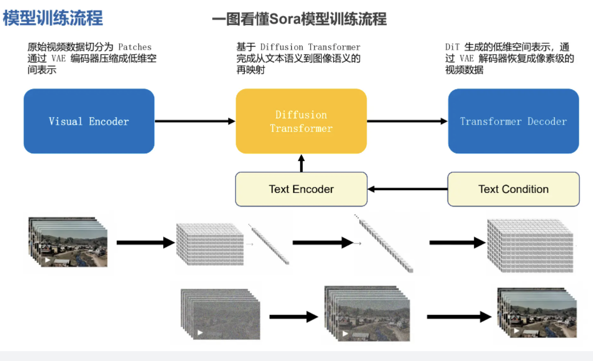
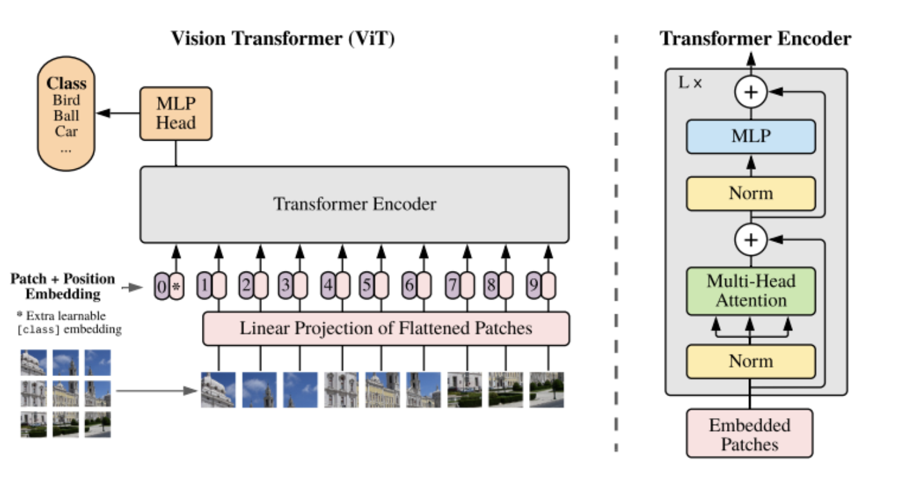

# sora 技术
## sora 模型训练流程
1. 视频压缩到低维空间
2. 基于 diffusion transformer完成从文本语义到图像语义的映射
3. DiT生成的低维空间表示，通过var解码器恢复成像素级视频数据

        图：来源datawhale团队

### DiT 工作原理
DiT 首先将空间表示输入通过第一层网络，将每个 patch 线性嵌入到输入中，以此将空间输入转换为一个数个 token 序列。然后，模型会将标准的基于 ViT 频率的位置嵌入应用于所有输入 token。接着，输入 token 由一系列 transformer 块处理。除了噪声图像输入之外，扩散模型有时还会处理额外的条件信息，例如噪声时间步长、类标签、自然语言等。DiT 探索了四种transformer 块变体，分别以不同方式处理条件输入。

## sora 关键技术拆解
ViT:ViT将输入图片分为多个patch（16x16），再将每个patch投影为固定长度的向量送入Transformer，后续encoder的操作和原始Transformer中完全相同。但是因为对图片分类，因此在输入序列中加入一个特殊的token，该token对应的输出即为最后的类别预测

